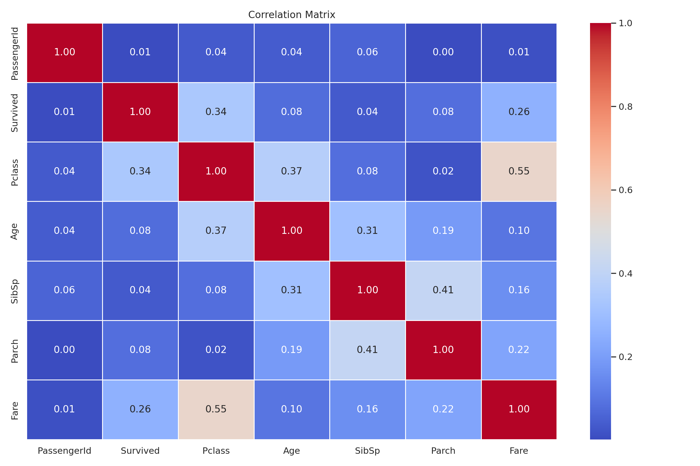

# CSI-Assignment---Week-4

````markdown
# 🚢 Titanic EDA Project

### 👨‍💻 Internship Assignment — Celebal Summer Internship  
  Author: Debargha Karmakar  
  Dataset: `train.csv` from the Titanic - Machine Learning from Disaster dataset

````
## 📊 Project Overview

This project performs a detailed **Exploratory Data Analysis (EDA)** on the Titanic dataset to uncover:

- Feature distributions
- Missing values
- Outliers
- Correlation between variables
- Visual patterns in survival rate

The analysis includes univariate, bivariate, and multivariate insights and is presented with clear, reproducible visualizations.

---

## 📁 Project Structure

```
titanic-eda-project/
├── train.csv                 # Dataset
├── eda_train.py             # EDA analysis script
├── pdf_report.py            # Script to generate a PDF report
├── eda_images/              # All saved plots and visualizations
├── EDA_Report_Titanic.pdf   # Final report (generated from Python)
└── README.md                # Project documentation
````

---

## 📌 Features Analyzed

* Distribution of numerical & categorical features
* Missing value heatmaps
* Outlier detection using boxplots and IQR
* Correlation heatmap
* Cramér’s V for categorical variables
* Survival analysis across:

  * `Pclass`
  * `Sex`
  * `Embarked`

---

## 🧰 Tech Stack

* Python
* Pandas
* Seaborn & Matplotlib
* Missingno
* NumPy
* PDF generation with `matplotlib.backends.backend_pdf`

---

## 📝 How to Run

1. Clone the repo:

   ```bash
   git clone https://github.com/Debargha-07/CSI-Assignment---Week-4.git
   cd CSI-Assignment---Week-4
   ```

2. Install dependencies (via pip):

   ```bash
   pip install pandas numpy seaborn matplotlib missingno fpdf
   ```

3. Run the EDA and save the plots:

   ```bash
   python eda_train.py
   ```

4. Generate the PDF report:

   ```bash
   python eda_report.py
   ```

---

## 📘 Sample Visualizations

Here are a few plots generated during the analysis:

### 📌 Survival Rate by Class and Sex


### 📌 Correlation Matrix



---

## 📈 Final Report

Download or view the final PDF report here:
📄 [EDA\_Report\_Titanic.pdf](./EDA_Report_Titanic.pdf)

---


## 🔖 License

This project is for educational and internship purposes only. Dataset © [Kaggle Titanic Competition](https://www.kaggle.com/c/titanic).

---


